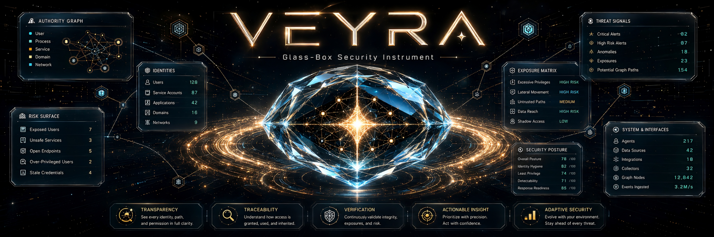
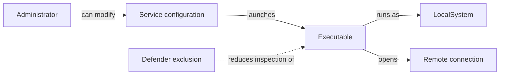
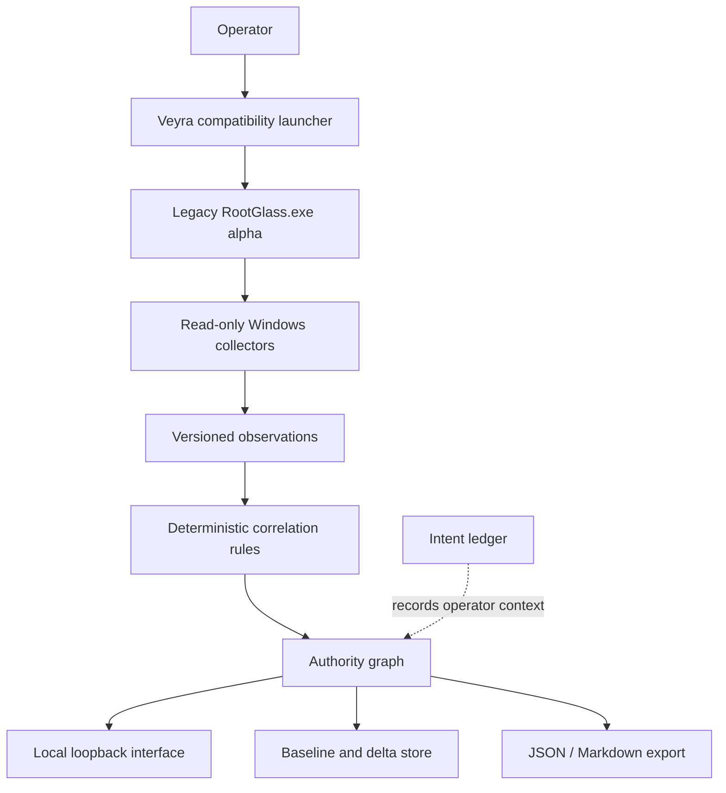

<p align="center">
  
</p>

<p align="center">
  <sub><strong>Concept visualization</strong> · not a product screenshot · displayed values are illustrative</sub>
</p>

<h1 align="center">VEYRA</h1>

<p align="center">
  <strong>See what has power over your machine—and why.</strong><br>
  A local-first, read-only glass-box security instrument for Windows authority, persistence, change, and evidence.
</p>

<p align="center">
  <a href="https://github.com/Konfusi0n/Veyra/actions/workflows/verify-portable.yml"></a>
  
  
  
  
</p>

<p align="center">
  <a href="#the-instrument">Instrument</a> ·
  <a href="#the-first-sixty-seconds">Experience</a> ·
  <a href="#the-authority-graph">Authority Graph</a> ·
  <a href="#what-is-real-today">Proof</a> ·
  <a href="#run-the-portable-alpha">Run</a> ·
  <a href="#architecture">Architecture</a> ·
  <a href="ROADMAP.md">Roadmap</a>
</p>

<p align="center">
  <sub><strong>OBSERVE → CORRELATE → EXPLAIN → PRESERVE → RECOMMEND</strong></sub>
</p>

---

## The instrument

> **Most security tools tell you that something is risky. Veyra shows you the authority chain that makes it matter.**

Windows does not have one place where authority lives. It accumulates across services, scheduled tasks, startup entries, executable trust, file permissions, Defender exclusions, interception mechanisms, process ancestry, and live network connections.

Each surface is individually inspectable. The problem is the relationship between them.

An unsigned executable is not automatically malicious. An outbound connection is not automatically suspicious. An automatic service is not automatically unwanted. But when the same executable is launched automatically, runs as `LocalSystem`, lives in a user-writable location, sits beneath a security exclusion, and opens an unexplained external connection, the combined authority deserves review.

Veyra turns those disconnected facts into an inspectable causal model:

```text
WHO
  has
WHAT CAPABILITY
  over
WHICH RESOURCE
  through
WHAT MECHANISM
  supported by
WHICH EVIDENCE
```

It does not need to shout **malware**. It can make the narrower, more defensible statement:

> **This software possesses unusual machine authority. You should understand why.**

That is the product.

---

## The first sixty seconds

Veyra is designed to compress a messy Windows machine into a small number of reviewable conditions without hiding the underlying facts.

```text
open Veyra
      ↓
collect local, read-only Windows evidence
      ↓
normalize identities, persistence, files, processes, controls, and sockets
      ↓
compile deterministic authority relationships
      ↓
surface no more than five material conditions
      ↓
select one condition
      ↓
watch its hidden authority path illuminate
      ↓
inspect the exact observation supporting every node, edge, and claim
```

A material condition can resolve into something like:

```text
SYSTEM AUTHORITY — REQUIRES REVIEW

Automatic service
      ↓ launches
Unsigned executable in user-writable storage
      ↓ executes as
NT AUTHORITY\SYSTEM
      ↓ owns
Active external connection

Confidence: HIGH
Basis: 5 observations / 4 independent collectors

Known:
✓ Persistent across reboot
✓ Executes with SYSTEM authority
✓ Binary is unsigned
✓ Installation path is user-writable
✓ Active external communication

Unknown:
? Installation provenance
? Remote endpoint purpose
? Whether disabling it would break dependent software
```

The interface is not supposed to win by showing more data. It wins by making one consequential relationship understandable in under a minute.

---

## The authority graph

Most Windows utilities organize the machine into tables. Veyra organizes it around **authority**.



That graph makes questions possible that Task Manager alone cannot answer:

- What can execute as `SYSTEM`?
- Which elevated executables are not Microsoft-signed?
- What can persist without appearing in Startup Apps?
- Which programs can replace or download executable code?
- What security controls contain broad exclusions?
- Which executable is reachable from more than one persistence mechanism?
- What gained authority since the last clean snapshot?

### Time changes the question

The first snapshot asks:

> **What has authority now?**

A baseline asks something stronger:

> **What changed about who controls this machine?**

Veyra's delta engine tracks material changes to services, startup entries, scheduled tasks, Defender exclusions, IFEO, AppInit, WMI persistence, executable hashes, and signature state. The long-term aim is a kind of **Git history for machine authority**: not merely what is running, but where durable control appeared, disappeared, or expanded.

---

## The glass-box contract

Veyra keeps machine truth, deterministic reasoning, outside intelligence, explanation, and uncertainty visibly separate.

| Layer | Meaning | Authority |
|---|---|---|
| **Observed** | Directly collected from the local machine. | May establish a measured fact, bounded by collector access and freshness. |
| **Derived** | Deterministically computed from one or more observations. | May establish a reproducible relationship or finding. |
| **External** | Reputation, publisher, or endpoint context obtained from another source. | May add context; it does not overwrite local evidence. |
| **Interpreted** | A human- or model-readable explanation of structured evidence. | May explain or prioritize; it does not become machine truth. |
| **Unknown** | Evidence is missing, inaccessible, stale, or inconclusive. | Remains unresolved. It is never silently converted into confidence. |
| **Intent** | The operator recognizes, rejects, or wants to review delegated authority. | Records consent separately; it never erases evidence. |

Every material indicator should answer five questions:

1. **Why was this surfaced?**
2. **According to what evidence?**
3. **What remains unknown?**
4. **What would the proposed response change?**
5. **How would the result be verified or reversed?**

The model is not the security oracle. Collectors establish observations. Deterministic rules compile relationships. A model may eventually explain a bounded evidence packet. It may not declare compromise, authorize mutation, or manufacture missing machine truth.

---

## Operator surfaces

The imported v0.1.1 alpha describes six connected surfaces:

| Surface | Purpose |
|---|---|
| **Trust Overview** | Compress hundreds of rows into at most five conditions that actually deserve attention. |
| **Authority Graph** | Connect persistence, executable artifacts, identities, processes, controls, and network endpoints into causal paths. |
| **Investigation Mode** | Show the claim, confidence, compound reasoning, unknowns, evidence provenance, and next safe investigation step. |
| **Timeline / Delta** | Compare snapshots and surface material changes in durable machine authority. |
| **Evidence Inventory** | Retain searchable raw facts behind the compressed interface. |
| **Intent Ledger** | Keep user recognition or rejection separate from observations and findings. |

JSON and Markdown exports preserve the local snapshot for independent inspection. No account or cloud service is required by the alpha's documented design.

---

## What is real today

Veyra applies its own doctrine to itself: appearance is not proof, and a polished repository must not hide its evidence boundary.

| Claim | Current repository truth |
|---|---|
| **Public subject** | `main` currently contains one imported portable Windows alpha, launcher files, release documents, and this presentation layer. |
| **Executable** | A 6,476,288-byte Windows x64 GUI binary is present under the legacy name `RootGlass.exe`. |
| **Source** | The Go source tree described by the imported documentation is **not present in this repository**. The current binary cannot be reproduced from this checkout. |
| **Build evidence** | The imported manifest and verification receipt report Go tests, vetting, policy gates, and a Windows cross-build performed against a separate source package. Those gates cannot be rerun here. |
| **Hosted CI** | The Veyra correction adds an exact-head Windows package gate for hash, manifest, byte size, PE target, unsigned status, and launcher help. It does not execute the security collector. |
| **Windows proof** | The receipt explicitly leaves Windows-native collector execution, browser launch, and protected-evidence coverage pending after the v0.1.1 hotfix. |
| **Signing** | The alpha binary is not Authenticode-signed. Windows SmartScreen may warn. |
| **Mutation** | The documented v0.1 boundary is read-only; the repository contains no evidence of a remediation capability. |

> [!IMPORTANT]
> **The current portable package is now independently coherent, but it is not source-provenanced.** The exact-head Windows gate recomputes SHA-256 `ecaaba0591251fb9f769d6e101646a87b5c719997c4f748204ca929bc639e9bf`, matching `CHECKSUMS.txt` and `RELEASE_MANIFEST.json`; it also verifies the declared byte size, AMD64 PE32+ Windows GUI target, and unsigned status. The imported [`VERIFICATION.md`](VERIFICATION.md) receipt names a different hash and is therefore preserved as a historical receipt for another or earlier artifact—not proof for the tracked binary. Source binding and live collector behavior remain unresolved.

This is not cosmetic self-criticism. It is Veyra's thesis applied inward: **a confidence-shaped document is not independent evidence.**

---

## Run the portable alpha

> [!WARNING]
> The current package is an unsigned, provenance-limited alpha. Evaluate it only on a machine you own and are prepared to inspect. Review [`SECURITY.md`](SECURITY.md) before running with elevation.

### 1. Download the repository

Use GitHub's **Code → Download ZIP**, extract it, and keep the launcher beside `RootGlass.exe`.

### 2. Compute the binary hash yourself

From Command Prompt:

```bat
certutil -hashfile RootGlass.exe SHA256
```

Stop if the result differs from `CHECKSUMS.txt`. A match proves byte identity with the package verified by the repository workflow; it does not prove source provenance, read-only runtime behavior, collector correctness, or a live-clean machine.

### 3. Launch

```bat
Veyra.cmd
```

For fuller visibility into protected Windows evidence:

```bat
Veyra.cmd admin
```

Elevation expands read visibility. It does not grant remediation authority in the documented v0.1 boundary.

### Legacy naming

Veyra is the current product and repository identity. The imported v0.1.1 binary, its embedded interface, environment variables, and local data directory still use the earlier **Root Glass** name. `Veyra.cmd` is a compatibility launcher; it does not pretend the binary rebrand is complete.

---

## Architecture

The imported alpha documentation reports a self-contained Go application with an embedded web interface and no Node, Python, .NET, installer, account, or cloud dependency.



The reported boundary is deliberately narrow:

```text
observe → correlate → explain → preserve evidence → recommend
```

It is not:

```text
detect → delete → hope
```

Because the source is not yet in this repository, the diagram is a documented architecture—not independently reproducible proof from this checkout. Importing and binding the source is Gate 0 of the [`ROADMAP.md`](ROADMAP.md).

---

## Read-only boundary

The imported v0.1 security contract excludes code paths that:

- terminate processes;
- stop, disable, create, or delete services or tasks;
- modify startup entries, the registry, Defender, or firewall settings;
- quarantine or delete files;
- download or upload evidence;
- inspect packet payloads;
- install a driver;
- persist Veyra itself.

The application is documented to bind only to a random loopback port, require a random per-run API token, validate Host and Origin, escape untrusted machine strings, load no external interface resources, and retire when the visible UI is gone and no scan is active.

Read the complete imported boundary in [`SECURITY.md`](SECURITY.md).

---

## Why Veyra is different

Veyra is not differentiated by owning a service collector, a process list, or a socket table. Mature tools already expose those facts.

The synthesis is the product:

> **A local-first, evidence-backed visual model of what possesses authority over a Windows system, how that authority was obtained, how it changes over time, and what evidence justifies every conclusion.**

That produces a different user reaction from “wow, lots of telemetry.”

It produces:

> **Holy shit. I can finally see what my computer is actually permitting.**

---

## Roadmap

The highest-leverage next move is not more collectors or autonomous remediation. It is making the existing alpha independently buildable and provable.

1. **Gate 0 — Release integrity:** import the complete source, bind receipts to an exact commit, reconcile the binary identity, add Windows CI, and publish live Windows proof.
2. **Authority Timeline:** connect first-seen authority changes to event history and installation provenance.
3. **Investigation Recursion:** resolve what created an object, what launches it, what it launches, and what trusts or ignores it.
4. **Evidence Packs:** produce versioned, privacy-redacted, independently inspectable investigation bundles.
5. **Bounded Remediation:** admit only typed actions with exact targets, effects, non-effects, rollback, receipts, and reboot verification.

See the proof contract and explicit non-goals in [`ROADMAP.md`](ROADMAP.md).

---

## Documentation

| Document | Purpose |
|---|---|
| [`README-FIRST.txt`](README-FIRST.txt) | Portable-package orientation and current proof warning. |
| [`RELEASE_NOTES.md`](RELEASE_NOTES.md) | v0.1.1 hotfix lineage and imported alpha scope. |
| [`RELEASE_MANIFEST.json`](RELEASE_MANIFEST.json) | Machine-readable imported build declaration. |
| [`CHECKSUMS.txt`](CHECKSUMS.txt) | Declared checksum for the tracked executable. |
| [`VERIFICATION.md`](VERIFICATION.md) | Historical build receipt and explicit identity mismatch. |
| [`SECURITY.md`](SECURITY.md) | Security boundary, sensitive assets, threats, and limitations. |
| [`ROADMAP.md`](ROADMAP.md) | Proof-ordered path from alpha integrity to bounded remediation. |
| [`LICENSE`](LICENSE) | Proprietary license terms. |

---

## Product identity

**Veyra** is the machine-authority and evidence instrument in the Direct Autonomy Systems portfolio.

It is not Sigil and it is not Sovereign. It shares laws with those systems—speech is not authority, capability is not permission, appearance is not proof, uncertainty stays explicit—but it retains its own identity, data boundary, release proof, and user promise.

The name **Root Glass** remains only as implementation lineage in the imported alpha artifacts until the source-backed rebrand can migrate executable names, storage paths, schemas, and receipts without breaking existing local evidence.

---

## License

Copyright © 2026 Direct Autonomy Systems LLC. All rights reserved.

This repository is proprietary. No permission is granted to copy, modify, distribute, sublicense, or sell the software except under a separate written license from the copyright holder. See [`LICENSE`](LICENSE).
